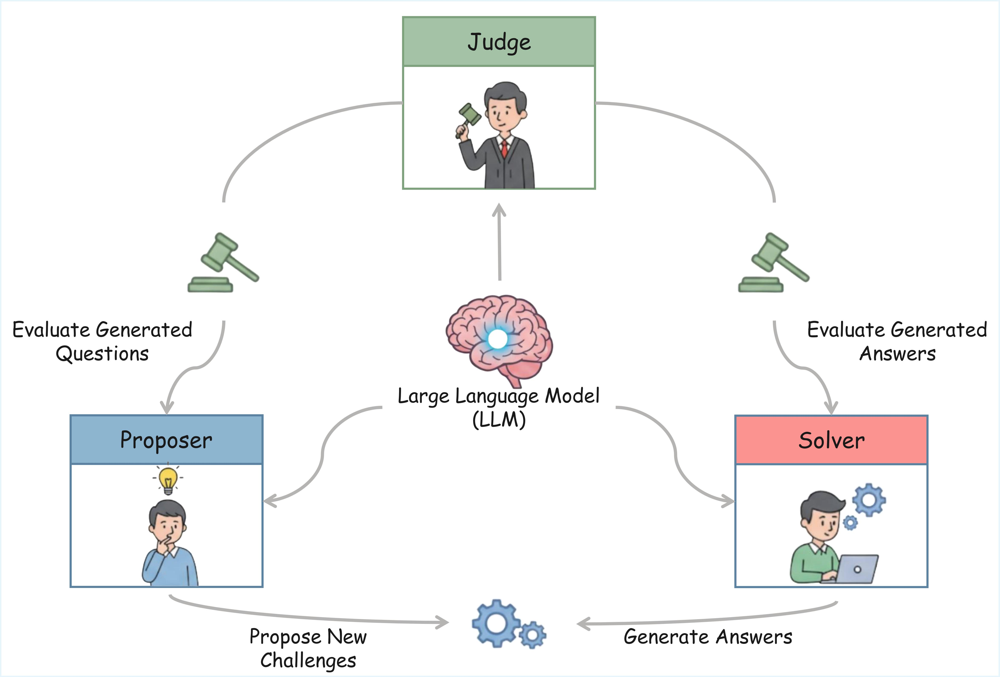
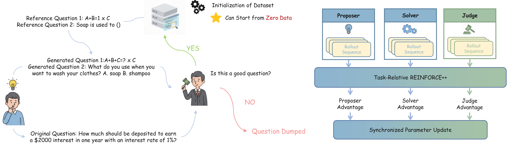

<div align="center">

# Multi-Agent Evolve: LLM Self-Improve through Co-Evolution 

[](https://arxiv.org/abs/2510.23595)
[](https://huggingface.co/collections/ulab-ai/multi-agent-evolve)


<div align="center" style="font-family: Arial, sans-serif;">
  <p>
    <a href="#links" style="text-decoration: none; font-weight: bold;">🔗 Links</a> •
    <a href="#algorithm-flow" style="text-decoration: none; font-weight: bold;">⚙️ Algorithm Flow</a> •
    <a href="#results" style="text-decoration: none; font-weight: bold;">📊 Results</a>
  </p>
  <p>
    <a href="#getting-started" style="text-decoration: none; font-weight: bold;">✨ Getting Started</a> •
    <a href="#training" style="text-decoration: none; font-weight: bold;">🏋️ Training</a> •
    <a href="#evaluation-code" style="text-decoration: none; font-weight: bold;">📃 Evaluation</a>
  </p>
  <p>
    <a href="#citation" style="text-decoration: none; font-weight: bold;">🎈 Citation</a> •
    <a href="#acknowledgement" style="text-decoration: none; font-weight: bold;">🌻 Acknowledgement</a> •
    <a href="#contact" style="text-decoration: none; font-weight: bold;">📧 Contact</a> •
    <a href="#star-history" style="text-decoration: none; font-weight: bold;">📈 Star History</a>
  </p>
</div>

</div>


<p align="center">
  
</p>


<!-- ============================================== -->
<div align="left">
  <h1 id="algorithm-flow">⚙️ Algorithm Flow</h1>
  <hr style="height: 3px; background: linear-gradient(90deg, #EF8E8D, #5755A3); border: none; border-radius: 3px;">
</div>


Our approach builds a self-evolving system for enhancing LLMs' general reasoning capabilities through three collaborative roles:

1. <span style="color:#EF8E8D"><b>Proposer</b></span>: Generates new reasoning questions wrapped in &lt;question&gt;...&lt;/question&gt;. Each question is evaluated for quality, difficulty, and format. Only high-quality and learnable questions are kept for training.

2. <span style="color:#5755A3"><b>Solver</b></span>: Answers the valid questions within &lt;answer&gt;...&lt;/answer&gt;. Its performance helps measure task difficulty and provides feedback for both question generation and model improvement.

3. <span style="color:#2AA198"><b>Judge</b></span>: Evaluates questions and answers, reasoning in &lt;think&gt;...&lt;/think&gt; and producing numeric scores in &lt;score&gt;...&lt;/score&gt;. These scores serve as rewards for Proposer and Solver, enabling stable reinforcement learning.

All three roles share one underlying model and are updated together using Task-Relative REINFORCE++. The system forms a continuous self-improving loop that strengthens reasoning without external supervision.

<p align="center">
  
</p>

<!-- ============================================== -->
<div align="left">
  <h1 id="results">📊 Results</h1>
  <hr style="height: 3px; background: linear-gradient(90deg, #EF8E8D, #5755A3); border: none; border-radius: 3px;">
</div>

## Main Results


<table>
  <thead>
    <tr>
      <th align="center">Model</th>
      <th align="center">ID Avg</th>
      <th align="center">OOD Avg</th>
      <th align="center">Total Avg</th>
    </tr>
  </thead>
  <tbody>
    <!-- Base Models Section -->
    <tr>
      <td colspan="4" align="center"><b>w/o reference questions</b></td>
    </tr>
    <tr>
      <td>Qwen2.5-3B-Instruct</td>
      <td>63.34</td>
      <td>41.32</td>
      <td>55.33</td>
    </tr>
    <tr>
      <td>AZR</td>
      <td>67.09</td>
      <td>41.33</td>
      <td>57.72</td>
    </tr>
    <tr>
      <td><b>MAE (zero)</b></td>
      <td><b>68.37</b></td>
      <td><b>42.48</b></td>
      <td><b>58.51</b></td>
    </tr>
    <!-- Zero-Style Reasoners with Code Data -->
    <tr>
      <td colspan="4" align="center"><b>w/ reference questions</b></td>
    </tr>
    <tr>
      <td>SFT</td>
      <td>63.28</td>
      <td>37.41</td>
      <td>53.87</td>
    </tr>
    <tr>
      <td>MAE (with reference)</td>
      <td>65.07</td>
      <td>43.18</td>
      <td>57.11</td>
    </tr>
    <tr>
      <td>MAE (no reference)</td>
      <td>67.51</td>
      <td>41.86</td>
      <td>58.18</td>
    </tr>
    <tr>
      <td class="underline"><b>MAE (half reference)</b></td>
      <td class="underline"><b>68.95</b></td>
      <td class="underline"><b>43.96</b></td>
      <td class="underline"><b>59.87</b></td>
    </tr>
  </tbody>
</table>


<!-- ============================================== -->
<div align="left">
  <h1 id="getting-started">✨ Getting Started</h1>
  <hr style="height: 3px; background: linear-gradient(90deg, #EF8E8D, #5755A3); border: none; border-radius: 3px;">
</div>

## 🎄 Environment Setup
```bash
conda create -n mae python=3.10
conda activate mae
pip install -r requirements.txt
pip install -r flashattn_requirements.txt
python scripts/prepare_test_datasets.py 
python -m absolute_zero_reasoner.data_construction.process_code_reasoning_data
```

## 🔗 Prepare API Key(s)

If you plan to use NVIDIA's integrated LLM service (NIM) for evaluation, you can obtain free API key(s) by registering an account at https://build.nvidia.com/nim.

Steps to register and save your API key(s):

1. Go to https://build.nvidia.com/nim and create an account (or sign in with your existing NVIDIA account).
2. After signing in, navigate to the [API_KEYS](https://build.nvidia.com/settings/api-keys) section and create a new API key. You may create multiple keys (probably through multiple acounts) if you want to distribute load.
3. Copy the generated API key(s).
4. In the root of this repository, create a file named `api.json` at the repository root (same directory as `README.md`) and store your keys in the following format:

```json
{
  "api_keys": [
    "sk-xxxxxxx-your-first-key-xxxx",
    "sk-yyyyyyy-your-second-key-yyyy"
  ]
}
```

## 🛠️ Prompts

Specializing the prompt can make the model tend to produce questions in certain domain or give scores according to desired rules. Make sure that the prompts are in similar format as the default prompt we provide and put under `absolute_zero_reasoner/data_construction/initial_prompt_templates`.

<!-- ============================================== -->
<div align="left">
  <h1 id="training">🏋️ Training</h1>
  <hr style="height: 3px; background: linear-gradient(90deg, #EF8E8D, #5755A3); border: none; border-radius: 3px;">
</div>

## 🌚 Resuming Runs
Three resume modes are supported: `disable`, `auto` and `resume_path`. `disable` allows you to train from scratch. `auto` resumes the run from the latest checkpoint inside `resume_dir`. `resume_path` allows you to resume from any checkpoint you want. 

```bash
    trainer.resume_mode=auto \
    trainer.resume_dir=<path_to_your_run_directory>\ # resume_dir has to be appointed if resume_mode is not `disable`
    trainer.resume_from_path=<path_to_your_checkpoint>\ # resume_from_path can be set to any specific checkpoint you wish to resume training from
```

When resuming runs, you can also put the original run wandb id into the script, i.e., `trainer.wandb_run_id=<run_id>`.

## ♟️ Multi-Agent Evolve Training

We use 8x80GB GPUs for 3B models, scripts can be modified to achieve the same overall accumulated batch size for reproduction. 

```bash
bash scripts/selfplay/mae.sh
# To explore different settings on reference questions, modify `include_references` to 0 or 1 for no reference and with reference
```

Other models are also supported in Multi-Agent Evolve framework, you can start the training for your own model by modifying `actor_rollout_ref.model.path` in scripts.

## 🤗 Converting veRL checkpoints to HF format
```bash
python -m absolute_zero_reasoner.utils.convert2hf \
  <veRL_ckpt_path>/actor \
  <veRL_ckpt_path>/actor/huggingface/ \
  <hf_ckpt_path>
```

<!-- ============================================== -->
<div align="left">
  <h1 id="evaluation-code">📃 Evaluation</h1>
  <hr style="height: 3px; background: linear-gradient(90deg, #EF8E8D, #5755A3); border: none; border-radius: 3px;">
</div>

## General Benchmarks

The general benchmarks will be evaluated during the training process. For complete evaluation on general benchmarks, run the following scripts by setting the resume checkpoint.

```bash
bash scripts/evaluation/eval_ID.sh
bash scripts/evaluation/eval_OOD.sh
# If you wish to evaluate base model, just set resume_mode to `disable` in these scripts
```

## Code Benchmarks
We use evalplus for code evaluation. A new conda env is needed for evalplus.
```bash
conda create -n evalplus python=3.11
pip install --upgrade "evalplus[vllm] @ git+https://github.com/evalplus/evalplus@d362e933265c3e7e3df8101c930a89c3c470cd9f"
Evaluation:
```bash
condda activate evalplus
bash evaluation/code_eval/scripts/run_evalplus.sh 0 <humaneval|mbpp> <hf_ckpt_path>
```


<!-- ============================================== -->
<div align="left">
  <h1 id="citation">🎈 Citation</h1>
  <hr style="height: 3px; background: linear-gradient(90deg, #EF8E8D, #5755A3); border: none; border-radius: 3px;">
</div>

If you find Multi-Agent Evolve helpful, please cite us.

```bibtex
@misc{chen2025multiagentevolvellmselfimprove,
      title={Multi-Agent Evolve: LLM Self-Improve through Co-evolution}, 
      author={Yixing Chen and Yiding Wang and Siqi Zhu and Haofei Yu and Tao Feng and Muhan Zhan and Mostofa Patwary and Jiaxuan You},
      year={2025},
      eprint={2510.23595},
      archivePrefix={arXiv},
      primaryClass={cs.AI},
      url={https://arxiv.org/abs/2510.23595}, 
}
```


<!-- ============================================== -->
<div align="left">
  <h1 id="acknowledgement">🌻 Acknowledgement</h1>
  <hr style="height: 3px; background: linear-gradient(90deg, #EF8E8D, #5755A3); border: none; border-radius: 3px;">
</div>

This project is inspired by and partially adapted from the [Absolute Zero Reasoner (AZR)](https://github.com/LeapLabTHU/Absolute-Zero-Reasoner) project. We thank the AZR authors for their open-source contributions and ideas.

<!-- ============================================== -->
<div align="left">
  <h1 id="contact">📧 Contact</h1>
  <hr style="height: 3px; background: linear-gradient(90deg, #EF8E8D, #5755A3); border: none; border-radius: 3px;">
</div>

Feel free to contact Yixing Chen and Yiding Wang via the following emails: polaris_dane@sjtu.edu.cn, yidingw@stu.pku.edu.cn

<!-- ============================================== -->
<div align="left">
  <h1 id="star-history">📈 Star History</h1>
  <hr style="height: 3px; background: linear-gradient(90deg, #EF8E8D, #5755A3); border: none; border-radius: 3px;">
</div>

 [](https://star-history.com/#ulab-uiuc/Multi-agent-evolve&Date&from=2025-10-29)
